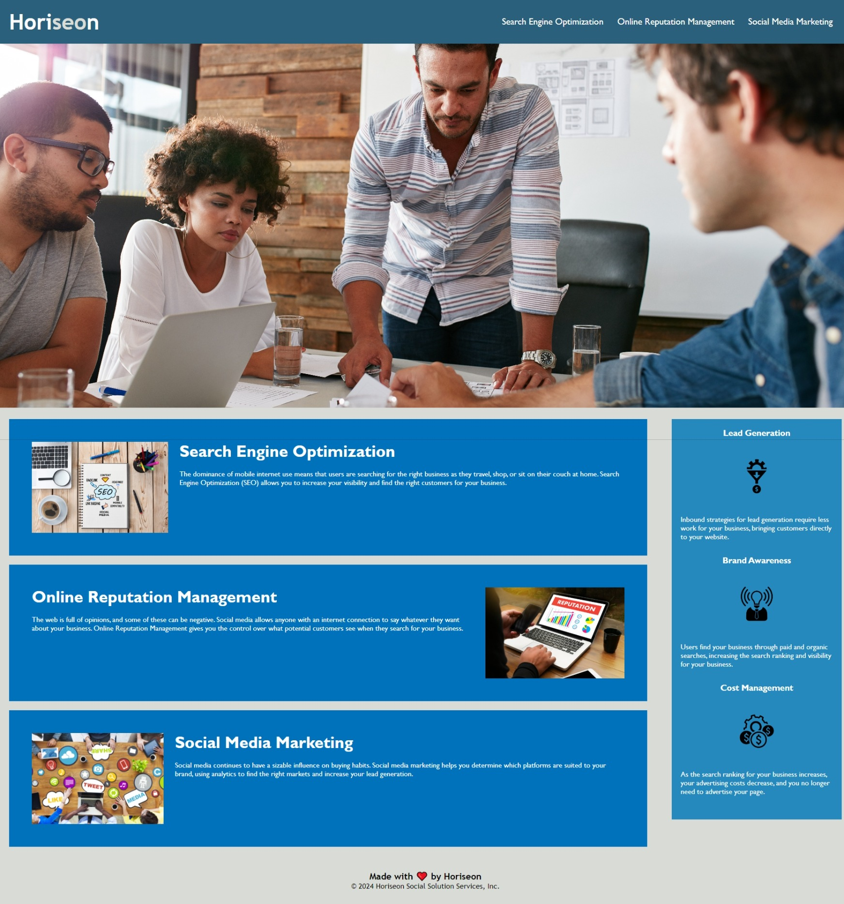

# Week One Project Webpage

## Description

For this project, I was looking to make the existing webpage more accessible and update the html/css so that it was more maintainable going forward.
I built this project to learn how to make a webpage accessible and how to work with existing code that may or may not have been written by me.
This project solves the problem of making a webpage accessible and refactoring existing code to make it more maintainable.
With this project, I learned how to make a webpage accessible and how to leave code better than I found it.

## Usage

To use the webpage, please navigate to https://mattm479.github.io/week-1-project. This webpage will look similar to the screenshot below:

## License

License can be found [here](LICENSE).
